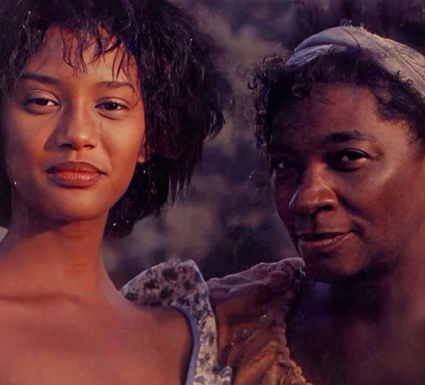
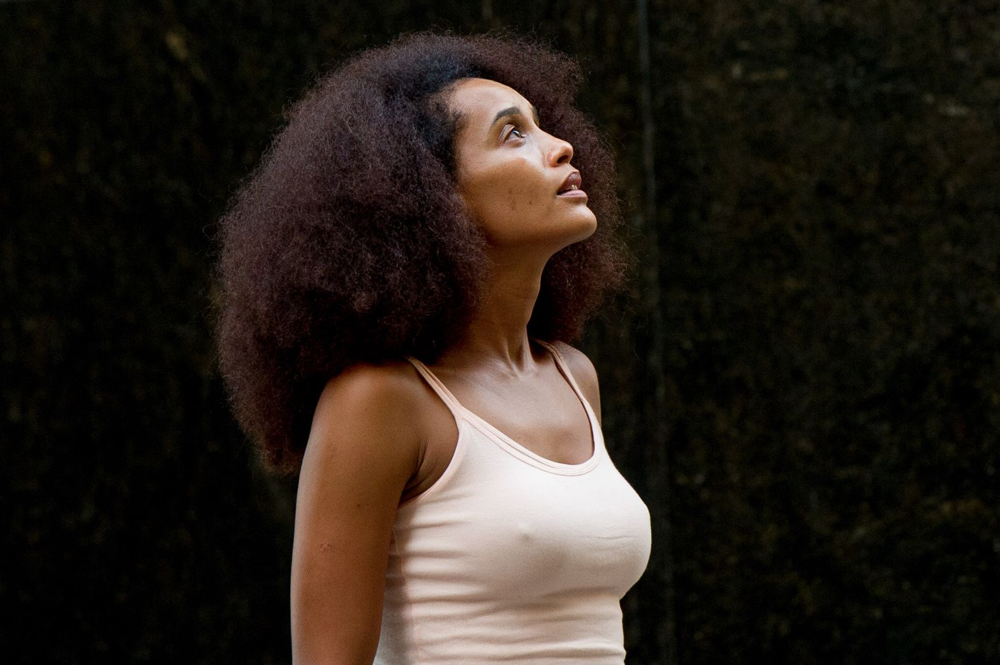

/* Trabalhos */
.titulo-sessao{
    min-height: 80vh;
    width: 100%;
    display: flex;
    justify-content:center;
}
.tais-xica{
    width: 10%;
    height: 110px;
    height: 110px;
    border-radius: 60%;
    right: 40rem;
}
#tais-penha{
    width: 10%;
    height: 110px;
    height: 110px;
    border-radius: 60%;
    float:right;
}
#tais-preta{
    width: 10%;
    height: 110px;
    height: 110px;
    border-radius: 60%;
    float:right;
}
#tais-medida{
    width: 10%;
    height: 110px;
    height: 110px;
    border-radius: 60%;
    float:right;
}

        <h2 class="titulo-sessao">Carreira e trabalhos</h2>

    
    <h3 class="nome--xica">Xica da Silva</h3>

    
    <h3 class="nome--trabalho">Cheias de charme</h3>

    
    <h3 class="nome--trabalho">Da cor do pecado</h3>

    
    <h3 class="nome--trabalho">Medida Provisória</h3>

    </section>

     .titulo-principal{
    width: 100%;
    display: flex;
    justify-content:center;
    text-align: center;
    padding: 10px;
}
.texto-maravilhosa{
    justify-content: right;
    padding: 8px;
    margin: 5px;
    right: 30rem;
}
.sessao-titulo{
    min-height: 10vh;
    width: 100%;
    display: flex;
    justify-content:center;
    text-align: center;
    padding: 10px;
}
.icon-personagem{
    width: 10%;
    height: 110px;
    border-radius: 60%;
   left :300px
}